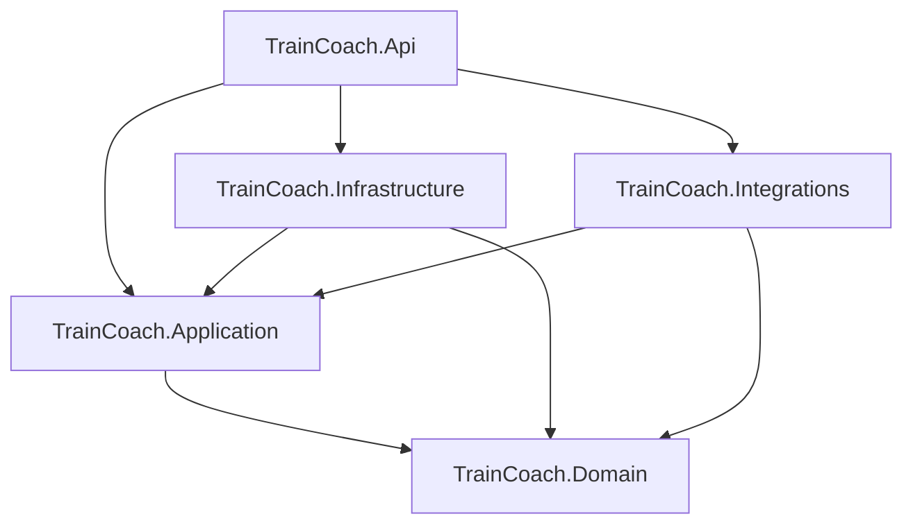
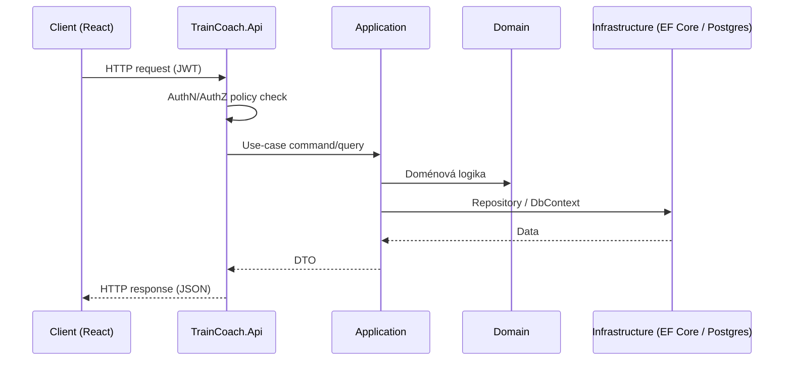

# TrainCoach — Architektura

## 1. Přehled

TrainCoach je **modulární monolit** postavený na .NET 10 / ASP.NET Core Web API na backendu a React + TypeScript + Vite na frontendu. Backend je rozdělen do pěti projektů podle vrstev (ne podle "modulů" v smyslu samostatně nasaditelných služeb), s jasným směrem závislostí. Cílem je mít strukturu, která se v budoucnu dá v případě potřeby rozdělit na služby, ale bez nákladů mikroslužeb od prvního dne.

## 2. Backendové projekty a vrstvení

```
TrainCoach.Api                — kontrolery, DI konfigurace, Program.cs, Swagger/OpenAPI
TrainCoach.Application        — use-case služby, DTO, FluentValidation validátory, rozhraní (interfaces)
TrainCoach.Domain             — entity, enumy, doménová logika — bez závislosti na frameworku
TrainCoach.Infrastructure     — EF Core DbContext, migrace, ASP.NET Core Identity, repository, background job runner
TrainCoach.Integrations       — Strava/Garmin/MySASY/import adaptéry za kontraktem IIntegrationProvider

TrainCoach.Domain.Tests
TrainCoach.Application.Tests
TrainCoach.Api.IntegrationTests
```

### 2.1 Směr závislostí



Klíčové pravidlo: **Domain nezávisí na ničem** (žádný framework, žádný EF Core, žádné ASP.NET). **Application závisí jen na Domain** a definuje rozhraní (např. `IWorkoutRepository`, `IIntegrationProvider`, `IReportPipeline`), která implementují Infrastructure a Integrations — tedy klasická inverze závislostí (Dependency Inversion). Api je kompoziční kořen — jediné místo, kde se DI kontejner skládá dohromady a kde jsou zaregistrované konkrétní implementace pro rozhraní z Application.

Toto rozdělení odpovídá zjednodušené Clean/Onion architektuře: `Api → Application → Domain`, s `Infrastructure` a `Integrations` jako vnějšími vrstvami, které Application vrstvu implementují, nikoliv na ní závisí obráceně.

### 2.2 Proč modulární monolit, ne mikroslužby

Viz `decisions/0001-modular-monolith.md` pro plné odůvodnění. Ve zkratce: pro MVP s jedním týmem a nejasnou budoucí zátěží mikroslužby přinášejí síťovou latenci, distribuované transakce, provozní náklady (orchestrace, service discovery, observabilita napříč službami) bez odpovídajícího přínosu. Modulární monolit drží jasné hranice na úrovni projektů/namespace už teď, takže případné budoucí vytěžení konkrétního modulu (např. Integrations nebo Reporting) do samostatné služby je možné bez přepisu domény.

## 3. Tok požadavku (request flow)

1. HTTP požadavek dorazí na kontroler v `TrainCoach.Api`.
2. Kontroler validuje autentizaci/autorizaci (JWT middleware, autorizační politika vázaná na `CoachAthleteRelationship` nebo přímé vlastnictví zdroje — viz `security.md`).
3. Kontroler zavolá use-case službu v `TrainCoach.Application` (např. `GetAthleteWeeklyPlanQuery`), předá DTO.
4. Application vrstva validuje vstup (FluentValidation), provede doménovou logiku přes entity v `TrainCoach.Domain`, případně zavolá rozhraní implementované v Infrastructure (repository, unit of work) nebo Integrations.
5. Výsledek se namapuje zpět na DTO a vrátí kontroleru, který jej serializuje jako HTTP odpověď.
6. Dlouhotrvající/asynchronní práce (generování reportu, spuštění synchronizace) se nevykonává v rámci HTTP požadavku — místo toho se zařadí do fronty a zpracuje na pozadí (viz níže).



## 4. Autentizace a autorizace

- **ASP.NET Core Identity** (`UserManager`, `SignInManager`) spravuje uživatele, hesla, reset hesla, uzamykání účtu po neúspěšných pokusech.
- Po úspěšném přihlášení backend vydá vlastní **JWT access token** (krátká životnost, typicky 10–15 minut) a **refresh token** (entita `RefreshToken` — uložena hashovaná hodnota, ne token samotný).
- Refresh token má rotaci při každém použití: klient pošle starý refresh token, backend jej invaliduje a vydá nový pár access+refresh token. To omezuje dopad úniku tokenu (opakované použití starého tokenu je detekovatelné a vede k revokaci celé session/rodiny tokenů).
- Jeden řádek `RefreshToken` odpovídá jedné relaci/zařízení, takže uživatel může mít přihlášeno více zařízení a jednotlivé session lze odvolat samostatně (např. "odhlásit všude").
- Podrobnosti a zdůvodnění viz `decisions/0005-auth-jwt-refresh-tokens.md` a `security.md`.

## 5. Background joby

- Žádná externí infrastruktura (Hangfire, Quartz) pro MVP — místo toho `BackgroundService` (hostovaná služba v rámci ASP.NET Core procesu) čte z in-process fronty `System.Threading.Channels.Channel<T>`.
- Typické úlohy: noční/na-vyžádání generování reportů, spuštění synchronizačního běhu s integrací (Strava apod.).
- Producent (Application/Api vrstva) zapíše požadavek do kanálu, konzument (BackgroundService v Infrastructure) jej zpracuje asynchronně mimo HTTP request.
- Toto řešení je vědomě jednoduché a **nahraditelné** — pokud v budoucnu poroste objem úloh, potřeba retry/scheduling přes restarty procesu nebo distribuovaného zpracování napříč instancemi, lze `Channel<T>` nahradit Hangfire/Quartz beze změny rozhraní volajícího kódu (viz `decisions/0003-background-jobs-hosted-service.md`).

## 6. Datová vrstva

- PostgreSQL přes Npgsql/EF Core (viz `decisions/0002-postgresql.md`).
- Doménový model je vědomě "portable" — žádné Postgres-specifické typy (např. `jsonb`) v jádru modelu. `WorkoutSegment` je normalizovaná dceřiná tabulka, ne JSON blob, aby šla dotazovat, validovat a testovat i proti SQLite v integračních testech.
- Migrace jsou spravované EF Core migrations v `TrainCoach.Infrastructure`.

## 7. Testovací strategie

| Vrstva | Nástroje | Poznámka |
|---|---|---|
| Domain | xUnit, FluentAssertions | Čisté unit testy bez závislostí |
| Application | xUnit, FluentAssertions, NSubstitute | Mockování rozhraní repository/integrací |
| Api (integrační) | `WebApplicationFactory`, EF Core SQLite relational provider | Docker/Testcontainers nejsou v sandboxu k dispozici, proto SQLite jako lokální náhrada; CI navíc spouští reálný Postgres kontejner |
| Frontend (unit) | Vitest, React Testing Library | Komponenty a hooky |
| Frontend (e2e) | Playwright | Spouští se vývojářem lokálně po `docker compose up`, ne uvnitř autorského sandboxu |

## 8. Integrace

- `TrainCoach.Integrations` obsahuje adaptéry za společným kontraktem `IIntegrationProvider` (např. `GetActivitiesAsync`, `ConnectAsync`, `RefreshTokenAsync`).
- Strava: reálný OAuth2 adaptér.
- Garmin, MySASY: kontrakt + mock/demo poskytovatel + souborový import jako fallback (viz `mvp-scope.md`, `security.md`).
- Google Sheets: souborový import (ne živé API), viz `product-requirements.md` a `mvp-scope.md`.
- Application vrstva zná integrace pouze přes `IIntegrationProvider`, nikdy přes konkrétní SDK — díky tomu lze přidat/nahradit poskytovatele bez zásahu do use-case logiky.

## 9. Frontendová architektura

### 9.1 Technologie

- **React + TypeScript + Vite** — rychlý dev server, ESM natively.
- **React Router** pro routování.
- **TanStack Query** pro server-state (cache, refetch, invalidace) — komponenty nedrží ručně kopie dat z API.
- **React Hook Form + Zod** pro formuláře a validaci na klientu (zrcadlí validaci FluentValidation na backendu).
- **Mantine** jako UI knihovna (přístupné formulářové prvky, date pickery, notifikace) — viz `decisions/0004-ui-library-mantine.md`.
- **react-i18next** pro i18n, výchozí jazyk čeština.
- API klient je **generovaný** z OpenAPI specifikace backendu nástrojem **orval**, včetně TanStack Query hooků — frontend nikdy neručí typy/klienty ručně, jen konzumuje vygenerované hooky (`useGetAthleteWeeklyPlan`, ...).

### 9.2 Struktura podle feature-folderů

```
src/
  app/               # routing, providers, layout aplikace
  api/                # generovaný klient (orval) — negenerovat ručně needituje se
  features/
    dashboard/
    calendar/
    workout-detail/
    check-in/
    nutrition/
    races-goals/
    reports/
    permissions/
    import/
  shared/
    components/       # sdílené prezentační komponenty
    hooks/
    i18n/
```

Každý feature-folder obsahuje vlastní komponenty, hooky vázané na danou feature a lokální stav; sdílený stav mezi featurami jde přes TanStack Query cache (server-state), ne přes globální store — pro čistě klientský UI stav (např. otevřený modál) postačí lokální `useState`/kontext v rámci feature.

### 9.3 PWA-ready poznámky

- Frontend nezávisí na žádném backendovém detailu specifickém pro webový prohlížeč — komunikuje výhradně přes REST/JSON API generovaný z OpenAPI.
- Vite podporuje přidání PWA pluginu (service worker, manifest) bez zásahu do zbytku kódu, až bude potřeba offline/mobilní scénář.
- Struktura feature-folderů usnadňuje budoucí sdílení logiky (validace, typy, případně části UI) s nativním/mobilním klientem, pokud by vznikl — doménová a validační logika je oddělená od zobrazovací vrstvy.
- Notifikace v aplikaci jsou navržené jako samostatná entita (`Notification`) a doručovací mechanismus oddělený od reportovací pipeline, takže push notifikace pro mobil lze později napojit jako další doručovací kanál bez změny reportovací logiky.

## 10. Lokální běh

- **Docker Compose** se třemi službami: backend, frontend, postgres.
- `.env.example` obsahuje potřebné proměnné bez reálných tajemství (např. `STRAVA_CLIENT_ID=`, `STRAVA_CLIENT_SECRET=` prázdné, `JWT_SIGNING_KEY=` placeholder).
- Vývojář, který chce reálné propojení se Stravou, doplní vlastní Strava API klíče do `.env`.
