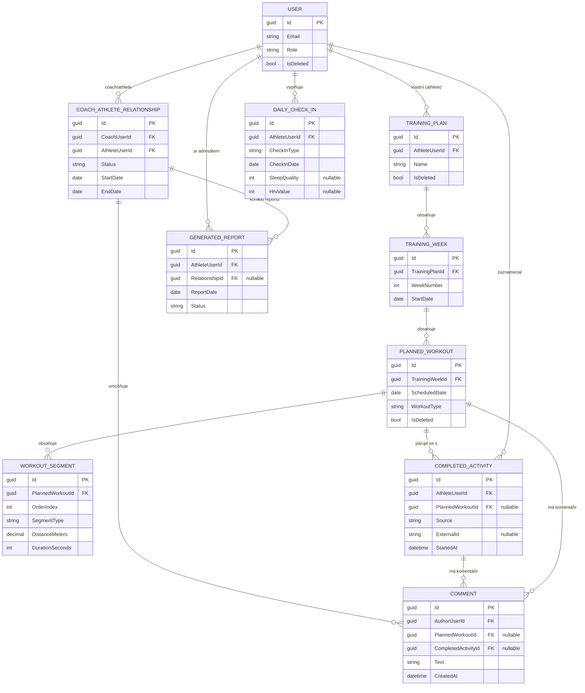

# TrainCoach — Datový model

## 1. Přehled

Datový model je rozdělen do šesti oblastí (bounded contexts): **Identita a přístup**, **Plánování**, **Realizace a zpětná vazba**, **Wellness**, **Výživa**, **Reporting** a **Integrace/Platforma**. Entity spolu souvisí primárně přes `AthleteProfile`/`User` a přes `CoachAthleteRelationship`, který je základem pro autorizaci napříč celým modelem.

## 2. Entity podle bounded contextu

### 2.1 Identita a přístup

| Entita | Popis |
|---|---|
| `User` | Základní identita (ASP.NET Core Identity), e-mail, hash hesla, role. Podporuje soft delete. |
| `UserProfile` | Obecné profilové údaje společné pro obě role (jméno, časové pásmo, jazyk, avatar). |
| `AthleteProfile` | Rozšíření profilu specifické pro sportovce (výchozí sporty, tréninkové preference). |
| `CoachProfile` | Rozšíření profilu specifické pro trenéra (specializace, kapacita svěřenců). |
| `CoachAthleteRelationship` | Vztah trenér–sportovec: stav pozvánky, datum začátku/konce, auditní stopa. Centrální entita pro autorizaci. |
| `RelationshipPermission` | Granulární oprávnění v rámci vztahu (např. přístup k tréninkovým vs. zdravotním datům). |
| `RefreshToken` | Hashovaná hodnota refresh tokenu, rotace, revokace, vazba na zařízení/relaci. |
| `AuditLog` | Záznam citlivých operací (přístup ke zdravotním datům, změna oprávnění, export/smazání dat). |

### 2.2 Plánování

| Entita | Popis |
|---|---|
| `Season` | Časové období sdružující cíle a závody sportovce (např. "Jaro 2026"). |
| `Goal` | Cíl sportovce v rámci sezóny (např. zlepšit čas na půlmaratonu). |
| `Race` | Konkrétní závod — datum, typ, cílový čas/umístění. |
| `TrainingPlan` | Tréninkový plán sportovce, obvykle vázaný na sezónu/cíl. Podporuje soft delete. |
| `TrainingWeek` | Týden v rámci tréninkového plánu. |
| `PlannedWorkout` | Naplánovaný trénink v rámci týdne — datum, typ, cíl. Podporuje soft delete. |
| `WorkoutSegment` | Strukturovaný úsek tréninku (rozcvičení, interval, tempo, výklus) — normalizovaná dceřiná tabulka, ne JSON. Patří vždy buď k `PlannedWorkout`, nebo k `WorkoutTemplate` (nikdy k oběma). |
| `WorkoutTemplate` | *(implementační doplněk nad rámec původního seznamu entit)* Trenérem uložitelný a znovupoužitelný trénink (feature "vytvářet šablony tréninků"), sdílí strukturu segmentů s `PlannedWorkout` beze duplikace. Zdůvodnění: explicitní požadavek na šablony v zadání, samotný `WorkoutSegment` ale nemá smysl bez vlastníka. |
| `HeartRateZone` | Definice tepových zón sportovce, používaná při plánování i vyhodnocení. |
| `CustomAbbreviation` | Uživatelsky spravovaný slovník zkratek (WU, CD, MK, ABC apod.) — nikdy hardcoded v kódu. |

### 2.3 Realizace a zpětná vazba

| Entita | Popis |
|---|---|
| `CompletedActivity` | Skutečně provedená aktivita (ze Strava/Garmin/manuál/import). |
| `ActivityMetric` | Jednotlivé naměřené metriky aktivity (tempo, tep, výška, kadence...). |
| `TrainingFeedback` | Subjektivní zpětná vazba sportovce k tréninku. |
| `Comment` | Komentář (trenér ↔ sportovec) navázaný typicky na trénink nebo den. |
| `DataProvenance` | Odkud konkrétní hodnota pochází (manual/import/strava/mock-provider) — základ pro řešení konfliktů zdrojů. |

### 2.4 Wellness

| Entita | Popis |
|---|---|
| `DailyCheckIn` | Jedna entita s discriminátorem typu Ranní/Večerní a nullable poli podle typu (ne table-per-hierarchy). |
| `PainOrHealthFlag` | Hlášení bolesti/příznaku nemoci — závažnost, lokalizace, poznámka. |
| `SleepRecord` | Záznam spánku (doba, kvalita, případně fáze). |
| `RecoveryMetric` | Odvozená metrika regenerace. |
| `HrvMeasurement` | Měření variability srdečního rytmu. |
| `PerformanceBaseline` | Osobní výchozí hodnoty pro vyhodnocování odchylek. |
| `PersonalRecord` | Osobní rekord odvozený z dokončených aktivit. |

### 2.5 Výživa

| Entita | Popis |
|---|---|
| `FoodEntry` | Záznam jídla. |
| `HydrationEntry` | Záznam příjmu tekutin. |

### 2.6 Reporting

| Entita | Popis |
|---|---|
| `GeneratedReport` | Výstup reportovací pipeline (výpočet metrik → pravidlový engine → generování textu → doručení), uložený jako samostatný záznam. |

### 2.7 Integrace a platforma

| Entita | Popis |
|---|---|
| `IntegrationConnection` | Propojení uživatele s externím poskytovatelem (Strava/Garmin/MySASY). |
| `IntegrationCredential` | Přihlašovací údaje/tokeny k integraci — šifrované at rest. |
| `SynchronizationRun` | Jeden běh synchronizace s externím zdrojem (stav, čas, výsledek). |
| `ImportedFile` | Nahraný soubor pro import (Google Sheets export apod.) a jeho zpracování. |
| `Notification` | Notifikace uživatele v aplikaci (a případně e-mailem). |

## 3. Klíčové vztahy a kardinality

- `User` 1—1 `UserProfile`; `User` 1—0..1 `AthleteProfile` nebo `CoachProfile` (podle role; uživatel může mít v principu obě role, ale typicky jednu).
- `CoachAthleteRelationship` N—1 `CoachProfile` a N—1 `AthleteProfile` (jeden trenér má více sportovců, sportovec může mít historicky více trenérů, ale typicky jeden aktivní vztah).
- `CoachAthleteRelationship` 1—N `RelationshipPermission`.
- `AthleteProfile` 1—N `Season` 1—N `Goal`, `Season` 1—N `Race`.
- `AthleteProfile` 1—N `TrainingPlan` 1—N `TrainingWeek` 1—N `PlannedWorkout` 1—N `WorkoutSegment`.
- `PlannedWorkout` 0..1—0..N `CompletedActivity` (párování plán vs. skutečnost — viz pravidla níže).
- `CompletedActivity` 1—N `ActivityMetric`, 1—N `DataProvenance` (na úrovni metriky nebo aktivity).
- `CompletedActivity`/`PlannedWorkout` 0..N `Comment`, 0..N `TrainingFeedback`.
- `AthleteProfile` 1—N `DailyCheckIn` 0..N `PainOrHealthFlag`.
- `AthleteProfile` 1—N `SleepRecord`, 1—N `HrvMeasurement`, 1—N `RecoveryMetric`, 1—N `PerformanceBaseline`, 1—N `PersonalRecord`.
- `AthleteProfile` 1—N `FoodEntry`, 1—N `HydrationEntry`.
- `AthleteProfile`/`CoachAthleteRelationship` 1—N `GeneratedReport`.
- `User` 1—N `IntegrationConnection` 1—1 `IntegrationCredential`, 1—N `SynchronizationRun`.
- `AthleteProfile` 1—N `ImportedFile`.
- `User` 1—N `Notification`, 1—N `RefreshToken`, 1—N `AuditLog` (jako subjekt nebo aktér).

## 4. ERD (core vertikála)



### Zbývající entity (mimo core vertikálu výše)

Identita/přístup: `UserProfile`, `AthleteProfile`, `CoachProfile`, `RelationshipPermission`, `RefreshToken`, `AuditLog`.
Plánování: `Season`, `Goal`, `Race`, `HeartRateZone`, `CustomAbbreviation`.
Realizace: `ActivityMetric`, `TrainingFeedback`, `DataProvenance`.
Wellness: `PainOrHealthFlag`, `SleepRecord`, `RecoveryMetric`, `HrvMeasurement`, `PerformanceBaseline`, `PersonalRecord`.
Výživa: `FoodEntry`, `HydrationEntry`.
Integrace/platforma: `IntegrationConnection`, `IntegrationCredential`, `SynchronizationRun`, `ImportedFile`, `Notification`.

## 5. Doménová pravidla

### 5.1 Deduplikace aktivit

Aktivita se považuje za duplicitní, pokud:

1. existuje jiná `CompletedActivity` téhož sportovce se **stejným zdrojem (`Source`) a stejným `ExternalId`** (např. dvě synchronizace ze Strava se stejným ID aktivity), nebo
2. neexistuje `ExternalId` (např. ruční zápis vs. import) a aktivita **fuzzy odpovídá** podle času začátku a vzdálenosti (v rámci konfigurovatelné tolerance, např. ±10 minut a ±5 % vzdálenosti).

Při detekované duplicitě se nová hodnota buď zahodí, nebo sloučí do existujícího záznamu podle pravidel priority zdroje (viz níže) — nikdy nevznikají dva nezávislé záznamy pro stejný běh.

### 5.2 Priorita zdroje (source precedence)

Pokud stejná metrika (např. tep, vzdálenost) přijde z více zdrojů pro tutéž aktivitu, uplatní se konfigurovatelné pořadí priority. Výchozí pořadí (nejnižší → nejvyšší priorita):

```
manual < import < live-API
```

Tj. hodnota z živého API propojení (např. Strava) má ve výchozím nastavení přednost před importovaným souborem, který má přednost před ručně zadanou hodnotou. Pořadí je konfigurovatelné na úrovni systému/uživatele, protože v některých případech je ruční korekce sportovce záměrně autoritativnější (např. oprava chybně zaznamenané vzdálenosti). Zdroj každé hodnoty je vždy dohledatelný přes `DataProvenance`.

### 5.3 Párování plánovaného a skutečného tréninku

- Primárně podle **data + sportovec** (jeden plánovaný trénink daného dne se páruje s aktivitou/aktivitami stejného dne).
- Volitelně explicitní vazba `PlannedWorkoutId` na `CompletedActivity`, pokud sportovec (nebo systém) párování potvrdí/ručně nastaví — užitečné při více aktivitách ve stejný den nebo posunu tréninku o den.
- Nespárovaná aktivita je platná (např. doplňkový běh navíc), nespárovaný plánovaný trénink je vyhodnocen jako nesplněný.

### 5.4 Soft delete

- `User`, `TrainingPlan`, `PlannedWorkout` používají soft delete (příznak `IsDeleted` + časová značka), nikdy fyzické mazání řádku.
- Důvod: zachování historie pro reporty, audit a integritu cizích klíčů (komentáře, feedback a aktivity navázané na smazaný plán/trénink zůstávají dohledatelné).
- Soft-deleted záznamy jsou vyloučeny ze standardních dotazů (global query filter v EF Core), ale dostupné pro audit/export.

### 5.5 Autorizační politika (ochrana proti IDOR)

- Žádný endpoint nesmí načíst data sportovce jen na základě ID v URL/požadavku.
- Autorizační politika se vždy vyhodnocuje buď jako **přímé vlastnictví** (uživatel žádá o svá vlastní data), nebo jako **aktivní `CoachAthleteRelationship`** s odpovídajícím `RelationshipPermission` pro danou kategorii dat (tréninková vs. zdravotní).
- Vyhodnocení probíhá na Application/Api vrstvě jako sdílená autorizační politika (handler), ne opakovaně ručně v každém use-case — viz `security.md`.

### 5.6 Souhlas a přístup k datům (consent-gated access)

- `CoachAthleteRelationship` musí mít stav odpovídající aktivnímu, sportovcem odsouhlasenému vztahu, než trenér získá jakýkoli přístup.
- Odvolání souhlasu (ukončení vztahu nebo zúžení `RelationshipPermission`) má okamžitý účinek na autorizaci — týká se i dat vytvořených před odvoláním.

### 5.7 Právo na výmaz a export dat

- Export: kompletní data sportovce (nebo trenéra) exportovatelná na vyžádání ve strojově čitelném formátu.
- Výmaz: realizován jako soft delete uživatele a anonymizace/omezení navázaných citlivých záznamů v souladu s právními požadavky (GDPR) — viz `security.md`.
